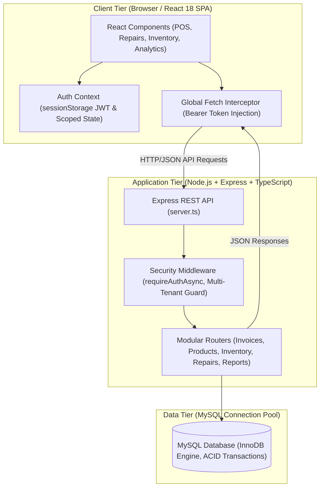
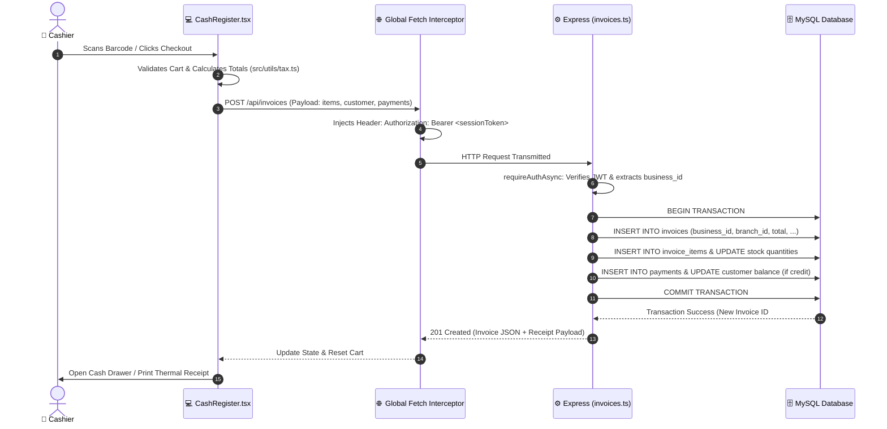

# 🎓 CS 301: Full-Stack System Architecture & Engineering Deep-Dive
**System:** Enterprise Point of Sale & Repair Workshop Management (EPOS)  
**Target Audience:** Computer Science Student / Software Engineer  
**Document Type:** Technical System Overview & Architectural Anatomy (`technicall.md`)

---

## 🏛️ 1. Executive Overview & High-Level Architecture

Welcome to the architectural breakdown of your EPOS platform. Think of this application as a high-performance **Three-Tier Client-Server Architecture** designed with **Multi-Tenant Isolation**:



---

## 📊 2. Codebase Inventory & File Count Breakdown

Here is the exact file distribution across your codebase:

| Category | File Count | Primary Languages / Formats | Key Responsibilities |
| :--- | :---: | :--- | :--- |
| **Frontend Components (UI Views)** | **69** | `.tsx` | POS Register, Invoices, Repairs, Inventory, CRM, Dashboard |
| **Backend & Shared Logic** | **28** | `.ts` | API Routes, Server Engine, DB Pool, Encryption, Tax Calc |
| **Build & Tooling Scripts** | **7** | `.cjs`, `.js`, `.bat` | Vite Bundler, Database Seeding, Build Automation |
| **Styling & Markup** | **2** | `.css`, `.html` | Tailwind CSS, Inter Font, App Root Container |
| **Configuration & Environment** | **7** | `.json`, `.env`, `.npmrc` | TypeScript config, Dependencies, Environment secrets |
| **Documentation** | **11** | `.md` | Architectural guides, changelogs, workflows |
| **Total Tracked Source Files** | **~125** | — | — |

---

## 🖥️ 3. The Frontend Tier (Client-Side Anatomy)

The frontend is built as a **Single Page Application (SPA)** using **React 18**, **TypeScript**, and **Vite**, styled with **Tailwind CSS**.

### A. How the Frontend Boots Up
1. **`index.html`**: The single HTML shell that loads fonts and contains `<div id="root"></div>`.
2. **`src/main.tsx`**: 
   - Mounts the React application.
   - **Global Fetch Interceptor:** Automatically intercepts all outgoing `fetch('/api/...')` requests and attaches the active JWT token from `sessionStorage`:
     ```typescript
     config.headers['Authorization'] = `Bearer ${sessionStorage.getItem('epos_token')}`;
     ```
   - Automatically handles `401 Unauthorized` responses and redirects to the login screen.
3. **`src/App.tsx`**: 
   - The master router (`react-router-dom`) mapping URLs like `/:branch/pos`, `/:branch/repairs`, and `/:branch/invoices` to their respective views.
   - Hosts global elements: top navigation bar, quick search hotkeys (`F2`, `F4`), and notification bells.

### B. State Management & Multi-Tenant Tab Isolation
- **`src/context/AuthContext.tsx`**:
  - Manages the logged-in user (`currentUser`), active branch, and permissions (`admin`, `staff`, `superadmin`).
  - **Tab Isolation:** Stores JWT tokens strictly in **`sessionStorage`** so each browser tab can run a completely different business or branch without session cross-contamination.
  - **3-Hour Terminal Inactivity Guard:** Automatically tracks mouse, keyboard, and barcode scanner interactions. If a terminal is untouched for 3 hours, it prompts a countdown and safely logs out to prevent unauthorized access.
- **`src/utils/storage.ts`**:
  - Implements **Scoped Namespacing**:
    $$\text{Storage Key} = \text{epos\_}\{\text{key}\}\_\text{u\_}\{\text{userId}\}\_\text{b\_}\{\text{businessId}\}\_\text{br\_}\{\text{branchId}\}$$
  - Ensures cart drafts, selected customers, and draft payments never collide even if multiple tabs are open on the same computer.

### C. Component Architecture by Feature Area
```
src/components/
├── cash-register/          # 16 POS Subcomponents (SpeedGrid, CartTable, Totals, Payments, IMEI Selection)
├── dashboard/              # Executive Analytics (Sales Trends, Profit Drivers, Peak Trading Hours)
├── auth/                   # Authentication (LoginPage, SignupPage, ResetPassword, AdminPortal)
├── inventory/              # Serialized IMEI Device tracking & SKU details
├── settings/               # SpeedGrid configuration, thermal printing settings
└── common/                 # Reusable health checks, modals, and progress bars
```

---

## ⚙️ 4. The Backend Tier (Server-Side Anatomy)

The backend is built with **Node.js**, **Express**, and **TypeScript**, compiled with **esbuild**.

### A. The Server Entrypoint (`server.ts`)
- Initializes environment variables (`dotenv`).
- Runs database schema auto-migrations (`initSchema()`) and seeds default tables.
- Sets up Express JSON body parsing (with `10MB` limit for image and repair signature uploads).
- Mounts REST API route handlers.
- In production, serves Vite-compiled static assets (`dist/`).

### B. The Modular Routing Layer (`src/routes/`)
Every business domain has its own dedicated router file:

| Route File | Base Path | Key Capabilities |
| :--- | :--- | :--- |
| **`auth.ts`** | `/api/auth` & `/api/admin` | User registration, password hashing (bcrypt), JWT generation, multi-branch switching. |
| **`products.ts`** | `/api/products` | Category management, brand catalog, SKU barcodes, wholesale & retail pricing. |
| **`inventory.ts`** | `/api/inventory` | Stock level tracking, serialized IMEI phone intake, inter-branch stock transfers. |
| **`invoices.ts`** | `/api/invoices` | Checkout transaction processing, receipt generation, multi-payment splits (Cash + Card + Split). |
| **`customers.ts`** | `/api/customers` | Customer profiles, balance / store credit tracking, purchase history lookup. |
| **`reports.ts`** | `/api/reports` | End-of-day X/Z reports, daily starting cash float, profit/loss and VAT calculation. |
| **`settings.ts`** | `/api/settings` | Company details, VAT tax rates, receipt headers/footers, thermal printer profiles. |
| **`public.ts`** | `/api/public` | Customer-facing public repair tracking portal (tracking repair status via ticket code). |

### C. Infrastructure Services & Utilities
- **`src/mysql.ts`**: Initializes the MySQL connection pool (`mysql2/promise`) and sets session timezones matching account settings.
- **`src/services/mailer.ts`**: Transports transactional emails (receipts, password resets).
- **`src/utils/crypto.ts`**: Encrypts sensitive credentials (like SMTP passwords) at rest using **AES-256-GCM**.
- **`src/utils/tax.ts`**: Calculates tax-inclusive and tax-exclusive line items according to regional VAT regulations.

---

## 🔄 5. End-to-End Data Flow (Life of a Transaction)

Let's trace what happens when a cashier rings up a sale:



---

## 🔒 6. Security, Multi-Tenancy & Data Integrity

1. **Strict Multi-Tenancy:**
   - Every single database table has a `business_id` column.
   - Every SQL query enforces `WHERE business_id = ?` using the verified `req.user.business_id` from the decoded JWT token.
   - Tenant A can never see or modify Tenant B's records.

2. **Database Transactions (ACID):**
   - Critical operations (such as checkout, repair intake, and stock transfer) use `conn.beginTransaction()`, `conn.commit()`, and `conn.rollback()`.
   - If a network error occurs halfway through checkout, the inventory deduction and payment are safely rolled back with zero orphaned records.

3. **Credential Protection:**
   - User passwords are salted and hashed using `bcrypt`.
   - Sensitive SMTP passwords stored in the database are encrypted with **AES-256-GCM** using a master secret key.

---

## 💡 7. Summary for Developers & Maintainers

- **Frontend entry:** [`src/main.tsx`](file:///c:/Users/User/Downloads/epos-main/src/main.tsx) $\rightarrow$ [`src/App.tsx`](file:///c:/Users/User/Downloads/epos-main/src/App.tsx)
- **Backend entry:** [`server.ts`](file:///c:/Users/User/Downloads/epos-main/server.ts) $\rightarrow$ [`src/routes/`](file:///c:/Users/User/Downloads/epos-main/src/routes/)
- **Database schema:** [`src/mysql.ts`](file:///c:/Users/User/Downloads/epos-main/src/mysql.ts)
- **Build command:** `npm run build` (Vite compiles React bundle $\rightarrow$ esbuild compiles `server.ts` $\rightarrow$ `server.js`).
